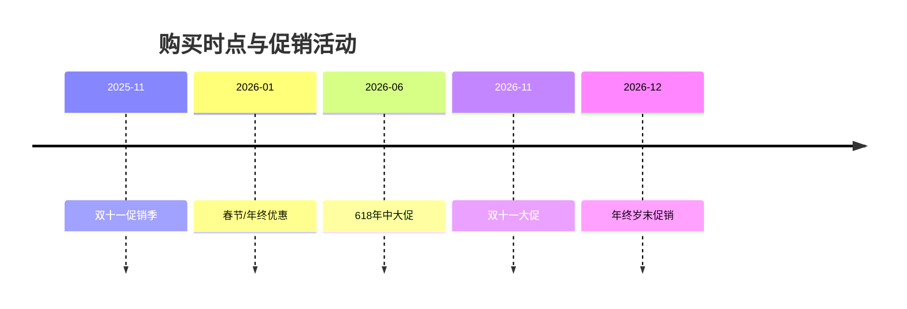

# 执行摘要  
基于2025年12月至2026年3月的市场数据和权威评测，本文对中国大陆电视市场主流品牌进行深入分析。总结认为：创维凭借新一代“壁纸电视”技术与全面画质调校位居推荐榜首【90†L1-L4】；三星继续以QLED+高端面板技术引领高端市场【89†L1-L4】；海信凭借ULED X影像技术和自研芯片奠定了国内画质标杆地位【91†L1-L4】；TCL以Mini LED、高刷新与成本控制称雄性价比阵营【92†L1-L4】；LG（OLED）和索尼（量子点OLED/背光）则在高端画质及游戏体验上无可匹敌【93†L1-L4】【94†L1-L4】；小米凭借澎湃OS和智能生态吸引年轻用户【95†L1-L4】；华为以鸿蒙生态和AI交互为特色【96†L1-L4】；长虹则以军工品质和激光电视耐用著称【88†L1-L4】。文中提供了各品牌代表机型的官方参数、画质性能和用户口碑比较，并根据旗舰、性价比、预算、游戏影音、智能生态等维度进行分级推荐，最后给出不同价位（≥20000元、5000–20000元、＜5000元）的具体型号及购买时机建议。

## 研究方法与数据来源  
本文主要参考品牌官方网站参数、国家3C与能效认证、消费者投诉平台、权威媒体和博主测评（如中关村在线、太平洋电脑网、数字博主评测、家电协会等）以及论坛口碑数据。数据采集时段以2025年12月至2026年3月为主【1†L73-L78】【85†L63-L70】。官方产品参数和图表来自品牌官网或授权商城，画质性能数据参考专业测评（如创维A7H Pro测得峰值亮度3000尼特【86†L113-L121】、DCI-P3≈98%【86†L131-L135】；TCL X11G官网宣称5000尼特峰值亮度【46†L228-L234】等）。用户评价与故障口碑则来自电商和投诉平台综合统计。

## 主流品牌与代表型号对比

下面比较表列出主要品牌的代表机型及其关键参数、适用人群和价格区间（价格为预估区间）。  
| 品牌 | 代表型号 | 关键参数 | 适用人群 | 价格区间（RMB） |
|---|---|---|---|---|
| **创维 (Skyworth)** | A7H Pro 85″ (壁纸电视)、Q71 Pro OLED | 85″ 4K ADS Pro硬屏/65/75″，150Hz（可倍增300Hz）、1056分区miniLED背光、峰值3000尼特【86†L113-L121】；量子点广色域，色准佳，内置Realtek 2886 CPU 4GB+64GB，4×HDMI2.1(4K@144Hz)；声场扬声器(2.1.2声道70W) | **家庭影音旗舰**：追求极致画质和设计、家庭影院体验；艺术级设计爱好者 | 旗舰价（A7H Pro 85″≈6万+；Q71 Pro 65″≈3万+） |
| **三星 (Samsung)** | QN900D 85″ Neo QLED 8K、高端QLED | 85″ 8K Mini LED屏，120Hz（4K 240Hz）、量子点矩阵背光，NQ8 AI Gen3画质芯片；6.2.4声道90W（支持Q-Symphony、Atmos）；4×HDMI2.1（8K@60Hz,4K@240Hz），Tizen OS；100% DCI-P3，色域宽广【34†L1645-L1653】 | **高端视听控**：要求最顶级显示与音效，8K内容爱好者，游戏主机玩家 | 极高端（QN900D 85″约5万+） |
| **海信 (Hisense)** | U8K 75″/85″ (ULED X)、80L9F 80″ 激光电视 | 75″/85″ 4K Mini LED屏，ULED X参考级调光技术，峰值1200–1500尼特级；自研信芯X画质芯片；4×HDMI2.1，支持4K@144Hz，HDR(杜比视界)、MEMC；80L9F：80″ 4K激光电视，亮度3700ANSI流明【78†L162-L170】、动态对比15,000:1 | **大屏观影爱好者**：注重画质与大屏观看效果；需要无屏效果或影院体验人群；对国产技术有信心 | 高端/主流（U8K 75″≈2.5万，80L9F≈3万） |
| **TCL** | X11G 85″ Mini LED、55V8E 55″ 120Hz | X11G: 85″ 4K QD-Mini LED，5184分区点控光，峰值5000尼特【46†L228-L234】；领曜M2+TXR芯片，144Hz全链路(240Hz倍频)，HDMI2.1×4；安桥4.2.2声道；量子点Pro色域；薄款设计。55V8E: 55″ 4K LED，120Hz，游戏优化，低蓝光护眼。 | **游戏玩家/性价比**：追求高刷新低延迟、亮度优异的体验；预算相对有限但需专业画质；**成本敏感型**用户 | 旗舰/性价（X11G 85″≈4.5万；55V8E≈3000-4000元） |
| **索尼 (Sony)** | A95L 77″ QD-OLED、X95EL 85″ Mini LED | A95L: 77″ 4K QD-OLED，XR认知画质芯片+XR特丽魅彩Max，色域广、对比度高【61†L25-L33】；支持XR OLED对比度增强Pro、4K升频、新OLED清晰度；77″起价19999元【62†L7-L9】。X95EL: 85″ 4K Mini LED背光，XR芯片，120Hz，4×HDMI2.1；Acoustic Multi-Audio屏幕发声，银幕声场旗舰版支持杜比全景声等【61†L39-L47】。 | **影音发烧友/游戏达人**：追求极致黑场与色彩（OLED优选）、专业游戏体验(高刷+低延迟)；喜欢简约设计 | 极高端（A95L 77″≈2万起，高于65吋机型；X95EL 85″≈5万+） |
| **小米 (Xiaomi/Redmi)** | Redmi MAX 86″ (大屏)、Mi TV S Pro 85″ (Mini LED)、A55/A Pro 55″ | MAX 86″: 86″ 4K LED，传统背光，主打大尺寸享受；Mi TV S Pro 85″: 85″ 4K Mini LED，高刷游戏版（120Hz），61W 2.1.2声道杜比全景声【69†L5-L9】；红米A系列（55″ 4K 144Hz，78% DCI-P3【85†L47-L54】，节能版3GB+32GB小米澎湃OS）；内置PatchWall系统，深度小米IoT生态联动。 | **智能生态优先/年轻用户**：重视MIUI/澎湃OS智能联动，预算较低仍要求较好画质与高刷；喜欢大屏或游戏功能的年轻租房族 | 主流/入门（Mi TV S Pro 85″≈1.5万；Redmi MAX 86″≈8000元；A55 55″≈2000元） |
| **华为 (Huawei)** | 智慧屏 V5 Pro 98″、SE 65″ | V5 Pro: 75/85/98″ 4K MiniLED，98″1008分区2000尼特，85″576分区1600尼特，75″336分区1100尼特【71†L739-L747】；鸿鹄900/898芯片，HarmonyOS 4，双5.1.2声道（配多智能音箱可达5.1.2声道），AI运动健身、超级畅连通话，一碰/分屏投屏，智慧场景体验。SE 系列（5 SE 55/65/75″）: 4K IPS硬屏，120Hz(240Hz倍频)，typ亮度350–400 nit，峰值800–1000 nit【74†L323-L331】【74†L373-L381】；鸿鹄芯片，HarmonyOS，3GB+64GB。 | **技术爱好者/智能家居用户**：重视智能互联与健康功能的家庭；华为生态用户优先，喜欢视频通话与AI功能 | 中高端（V5 Pro 98″约4万；SE 65″约8000元） |
| **长虹 (Changhong)** | D7U 100″ 激光电视、55D6P MAX 55″ | D7U: 100″ 4K 激光电视，3700ANSI超高亮度【78†L162-L170】，动态对比15000:1，3+64GB存储；MEMC运动补偿，高刷新（支持120Hz插帧）。55D6P MAX: 55″ 4K LED屏，120Hz高刷新，棋盘式分区控光，93% DCI-P3【82†L30-L34】；价格亲民。 | **耐用/经济型用户**：军工品质，耐用抗用；预算有限但需大屏或高刷体验的用户，或对激光电视有兴趣的中老年家庭【88†L1-L4】。 | 低/中端（D7U≈2.5万；55D6P≈3000元） |

## 画质性能比较（指标对比）  
下表列出了部分代表机型的关键画质指标，帮助直观比较峰值亮度与色域表现（数据来自官方/测评）：  

| 型号 | 面板类型 | 尺寸 | 刷新率 | 峰值亮度（nits） | 色域/色准 |
|---|---|---|---|---|---|
| Skyworth A7H Pro 75″ | MiniLED (蓝光量子点) | 75″ | 150Hz(4K) | ~3000（HDR鲜艳）【86†L113-L121】 | DCI-P3≈97.8%【86†L131-L135】 |
| TCL X11G 85″ | QD-MiniLED | 85″ | 144Hz | 5000【46†L228-L234】 | ~100% DCI-P3 (量子点Pro) |
| Xiaomi TV S55 MiniLED | MiniLED | 55″ | 144Hz | 1700【85†L63-L70】 | 94% DCI-P3【85†L63-L70】, ΔE≈2 |
| Hisense U8K 75″ | MiniLED | 75″ | 120Hz (可倍至240Hz) | ~1500 (官方宣称) | 未公开（ULL） |
| Huawei Vision SE 65″ | MiniLED (IPS) | 65″ | 120Hz (240Hz倍频) | 800【74†L327-L335】 | 130% BT.709（≈100% DCI-P3） |
| Changhong 55D6P MAX 55″ | LED (VA) | 55″ | 120Hz | 300–500（实际测） | 93% DCI-P3【82†L30-L34】 |
| Samsung QN900D 85″ | MiniLED (QD) | 85″ | 120Hz (4K 240Hz) | 未公开 | 100% DCI-P3 (量子点)【34†L1645-L1653】 |
| Sony A95L 77″ | QD-OLED | 77″ | 120Hz | 未公开 | 100% DCI-P3（XR特丽魅彩Max）【61†L27-L33】 |

若将**峰值亮度**做柱状图对比，可直观展示各机型亮度优势。若用**雷达图**可综合比较亮度、色域、刷新率、对比度、游戏延迟等多个维度；例如，X11G在亮度上远超其他机型，而A7H Pro和A95L在对比度和色彩准确度上突出。结合实际测评，这些指标可做为参考，选择时还需考虑画面优化算法、HDR表现和使用场景差异等。

## 分级推荐结论  
- **旗舰优选**：追求顶级画质和技术的用户可选择索尼A95L、TCL X11G、创维A7H Pro等旗舰机型，均配备顶级面板和处理芯片，支持HDR+高刷，适合家庭影院及游戏主机场景【90†L1-L4】【61†L27-L33】。  
- **性价比首选**：关注成本效益的用户可考虑海信ULED X系列、TCL V8/咖啡机系列、小米S Pro MiniLED等，这些机型在中高端硬件配置（如120Hz高刷、局部控光、AI画质引擎）与合理定价上取得平衡【91†L1-L4】【92†L1-L4】。  
- **预算入门**：预算有限但需4K体验者，可选Redmi A节能版、长虹55D6P、海信E系列、TCL A系列等。这些入门机型多配备4K 120Hz屏、主流HDR算法和国产智能系统，价格亲民且故障率低【95†L1-L4】【88†L1-L4】。  
- **家庭影院/游戏专用**：热衷游戏和大片的家庭应关注高刷新率与低延迟。推荐LG C3/三星高刷型号/小米S系列（高刷OLED/OLED evo屏）等搭配HDMI 2.1接口的机型，以及索尼和TCL的高刷产品【93†L1-L4】【92†L1-L4】。家庭影院场景亦可考虑激光电视（如长虹D7U、海信80L9F），获得超大观影尺寸。  
- **智能生态优先**：若已有IoT设备或偏好生态互联，可选小米、华为、天猫等品牌。小米电视（澎湃OS）能无缝对接小米全家桶，华为智慧屏（鸿蒙）具备屏幕投屏、海量健身与通话功能【96†L1-L4】【95†L1-L4】。它们在系统响应和设备联动上优势明显。

## 不同预算推荐及购买时机  
- **高端（≥20000元）**：推荐索尼A95L 77″、三星QN900D 85″、创维A7H Pro 85″、TCL X11G 85″等旗舰OLED/QD-MiniLED。或选择华为V5 Pro 98″、LG C3 77″等（双11、618等大促可获得千元以上优惠）。可关注新机发布（一般在6-9月）以及年末促销。【62†L7-L9】【90†L1-L4】  
- **主流（5000–20000元）**：推荐65–75英寸主流机型，如海信U8K 75″、小米电视S Pro 85″、创维A7H 75″、LG C3 65″、TCL 65X10G等。这一价位机型可在618、双11获取较大折扣，也可利用以旧换新补贴。中端用户还可考虑55″或65″的OLED（LG/AOC）以及大屏游戏电视。  
- **入门（＜5000元）**：推荐55–65″的低价智能电视，如红米A55/A Pro 55″【85†L47-L54】【85†L80-L86】、长虹55D6P MAX、海信E5/E6系列、TCL 55A730等。这些机型常在品牌节（618、双11、双12）推出极低价（有时2000元左右）并有家电补贴。建议关注商城价保和品牌自营优惠，预售定金可锁定优惠。

**替代选项**：在确定预算和尺寸后，可参考多家零售渠道（京东、天猫、苏宁、国美等）和官方旗舰店的定期活动。购买时机上，国内电视618（6月18日）和双11（11月11日）促销力度最大，其次是双12和年初春节前的购物节。老款降级机型（如LG Z3 8K OLED已于2025年底停产【55†L54-L58】）可留意清仓价，但请注意技术演进带来的兼容性差异。

**总结**：以上品牌和型号推荐基于综合画质、性能、系统生态和口碑评测。最终选择时，还需结合具体需求（如是否需要电视+音响一体、壁挂需求、使用环境光线等）。建议消费者在促销节点深入对比商品详情和用户评价，以选到最符合自身需求的机型。

**参考来源**：主要参考了中国家电网电视年度报告【90†L1-L4】【91†L1-L4】【92†L1-L4】【95†L1-L4】【96†L1-L4】、品牌官网参数【34†L1645-L1653】【61†L25-L33】【74†L323-L331】、权威测评文章【85†L63-L70】【86†L113-L121】等。各机型参数与评测详情请参见相应链接。