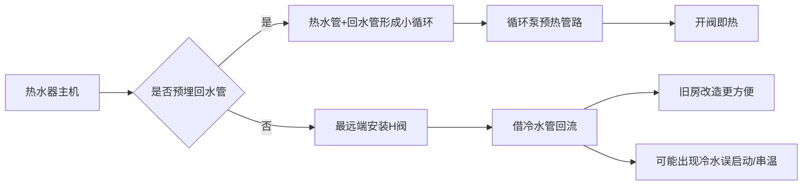
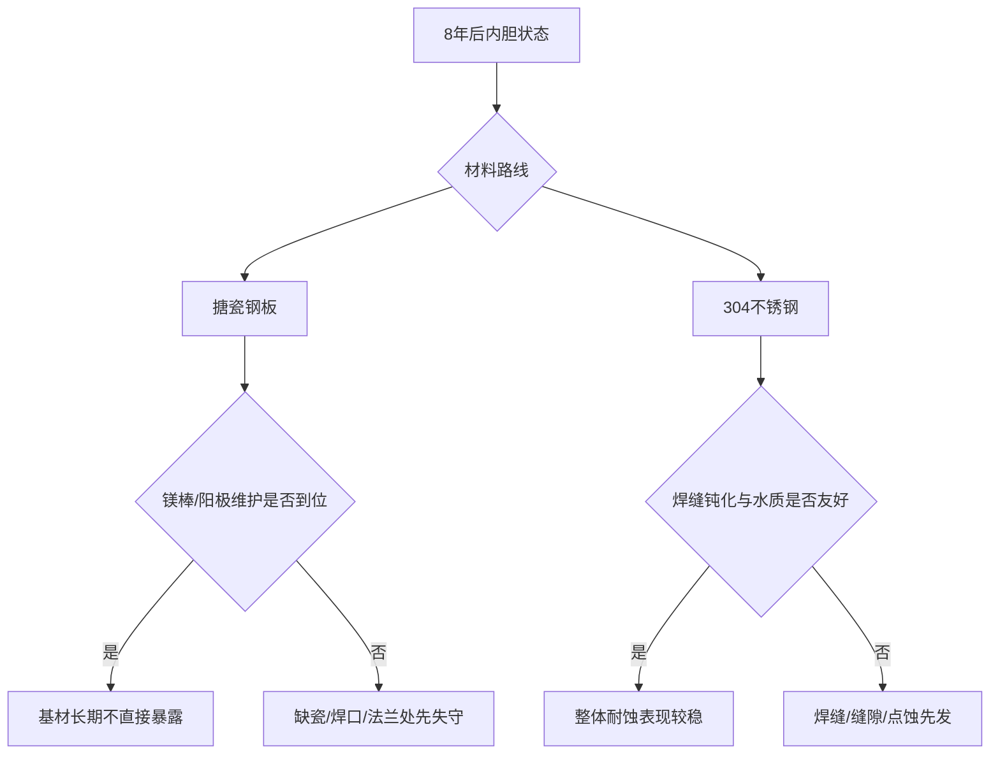

# 零冷水热水器与搪瓷内胆不锈钢内胆共享深度调研报告

## 执行摘要

这份报告围绕两条研究线展开：其一是**零冷水燃气热水器**，其二是**储水式电热水器的搪瓷内胆与不锈钢内胆**。基于公开资料，零冷水的真实分水岭并不只是“有没有循环泵”，而是**安装条件是否允许做有回水管的小循环**。美的官方安装培训资料明确写出：无回水管方案需要在最远端安装 H 阀，把冷水管当回路；这一路线虽然适合旧房改造，但也更容易出现“开冷水误启动”“冷水串热”“部分冷水点流量过大时无法彻底解决”的问题，而有回水管方案则更适合保温、定时巡航与更稳定的体验。海尔、万和、万家乐等品牌公开页面也都在持续强调“三管零冷水”“双循环”“巡航预热”“外循环”等路线差异。换言之，第一篇文章的核心，不应只讲参数，而应把**户型、水路、最远端出水点、冷水共管设备**放在选购前置条件的最前面。citeturn19view0turn5search14turn15search2turn35search7

市场上，零冷水已经从单一卖点进入“舒适体验组合卖点”阶段。奥维云网口径显示，**2024 年上半年线上零冷水燃气热水器渗透率为 23%**，较 2022 年下降接近 7 个百分点；与此同时，**2025M1-M4 线上 16L 燃热零售额占比已达 68.0%，线下达 81.0%**，说明市场主战场已经稳定聚焦在 16L 主流段，而品牌宣传重点转向“静音、增压、无冷凝水、美肤、AI 恒温、小体积”等复合价值。2026 年一季度，奥维云网口径下**燃气热水器零售额 51 亿元，同比下滑 9.5%；电热水器零售额 51 亿元，同比增长 0.5%**，整体市场承压但结构升级仍在继续。citeturn30search0turn33view2turn39view0

第二篇文章最关键的结论是：**公开资料并不能支持“8 年后不锈钢一定优于搪瓷”这样的绝对判断**。行业层面的安全使用年限参考值是**储水式电热水器 8 年**；搪瓷路线的防腐逻辑是“玻璃质搪瓷层隔绝介质 + 镁棒/阳极牺牲保护”，真正的失效多发生在**缺瓷、焊口、法兰、搪瓷气泡、镁棒耗尽**这些系统薄弱点。不锈钢路线的优势在于无需依赖整面搪瓷完整性，但其弱点集中在**焊缝、热影响区、缝隙以及高氯离子环境下的点蚀**。因此，文章真正值得打出的观点，应是“**8 年后腐蚀结果由材料路线、焊接/涂覆工艺、水质、阳极维护、使用温度与清洗频率共同决定**”，而不是简单按“搪瓷 vs 不锈钢”二元对立。citeturn13search6turn24search6turn36search9turn38search0turn38search1turn38search6turn37search4

从消费策略上看，零冷水燃热的主购买带已经明显集中在**2000—4000 元**，再往上主要买到的是静音、下置风机、双循环、无冷凝水、美肤健康等高附加值；储水电热则在**500—1000 元**完成基础功能，在**1000—2000 元**开始进入一级能效、免换镁棒、Wi-Fi、双胆/纤薄等升级带，而**3000 元以上**的溢价重点越来越多落在“空间效率、活水健康、双胆纤薄、场景联动”，并不直接等于“防腐寿命线性翻倍”。citeturn15search1turn29view0turn22search3turn22search4turn23search5turn39view2

## 共同技术与市场基线

下文的七个模块均以表格呈现；其中，零冷水与内胆材质两条研究线并行展开。公开资料不足之处，一律标注为“待验证”。行业趋势与价格预判中的评分、区间推演，为**基于公开资料的研究者判断**，不是实验室实测。citeturn12view1turn33view2

图示用途：说明零冷水的两大主路线及旧房改造风险点；依据美的零冷水安装培训页、海尔“三管零冷水”产品页整理。citeturn19view0turn5search14turn15search1

**模块一 技术拆解**

| 研究线 | 技术路线 | 工作原理 | 关键零部件 | 公开优点 | 公开短板与避坑点 | 来源 |
|---|---|---|---|---|---|---|
| 零冷水 | 有回水管三管零冷水 | 热水管与回水管构成小循环，循环泵提前把管路冷水回收加热，开阀即热 | 内置循环泵、回水口、温度/流量传感器、控制板、保温管路 | 不借用冷水管回流，冷/热水干扰更小；更适合定时巡航与保温；海尔公开称“三管零冷水” | 装修前期最好预埋；若后期改造，存在水路改造成本与施工复杂度 | 海尔官方产品页与售后收费规则、美的安装培训页。citeturn5search14turn15search1turn16search7turn19view0 |
| 零冷水 | 无回水管 H 阀方案 | 在最远端装 H 阀，利用冷水管作为回流水路，热水经单向阀进入冷水管形成循环 | H 阀/回水阀、单向阀、循环泵、控制算法 | 旧房改造友好，不用重新埋回水管 | 美的培训页明确写出：可能出现开冷水误启动、冲马桶误启动；若冷水点流量 ≥3.5L/min，现阶段“不建议使用零冷水功能”；开冷水误启动时需靠调角阀/增阻解决 | 美的零冷水安装维修操作指引。citeturn19view0 |
| 零冷水 | 双循环/储能循环 | 通过储能舱/双循环逻辑减少关水再开时的“冷烫水”“温飘” | 储能舱、循环阀、循环泵、双伺服/水量伺服 | 海尔、万和公开都把“双循环/储能双循环”作为改善恒温体验的重点 | 结构更复杂，真实体验更依赖算法；一级供应商公开信息很少 | 海尔、万和官方产品页。citeturn5search10turn6search2turn6search6 |
| 零冷水 | 外循环/室外循环 | 把循环与排烟/安装形态做外置化/室外化处理，适配特殊柜体和安装条件 | 外循环烟管、循环泵、密闭稳燃/排烟系统 | 万和公开称“首创 660mm 外循环烟管，外循环吸排，密闭安全自由嵌” | 机型选择少、安装专业性高；更适合特殊场景，不是普通户型的大众解 | 万和官方产品页。citeturn15search2 |
| 内胆 | 搪瓷钢板 + 镁棒 | 搪瓷层把水与钢板隔开；一旦局部暴露，镁棒承担牺牲阳极保护 | 搪瓷层、碳钢基材、镁棒、焊口、法兰、加热管 | 成熟、成本可控，是主流大牌储水电热的长期路线 | 镁棒若长期不换，容易导致内胆或加热管腐蚀穿孔；万家乐建议差水质/耗损严重情况 2 年左右更换镁棒；排污建议 2 个月一次 | 万家乐保养页、光明网科普、搪瓷/专利与材料资料。citeturn24search6turn36search9turn38search1turn38search6 |
| 内胆 | 搪瓷升级路线 | 在搪瓷基础上做配方/工艺强化，品牌常见命名有“金圭”“金刚搪瓷”“全瓷”“瓷热仓”等 | 搪瓷钢基材、升级釉层、阳极系统、焊接工艺 | A.O.史密斯强调“金圭内胆 8 年整机质保”；海尔强调“金刚搪瓷/全瓷不留垢”；美的强调“活水瓷热仓/内胆免清洗”等 | 各品牌命名不等于同一技术等级，真正可靠性仍取决于焊接、涂覆一致性、阳极管理与水质 | A.O.史密斯、海尔、美的官方页。citeturn21search0turn20search2turn23search1turn23search2turn22search2turn22search3 |
| 内胆 | 304 不锈钢焊接内胆 | 依赖不锈钢表面钝化膜耐蚀，常见于工程储水箱或中小品牌家用机 | 304/316 不锈钢板、焊缝、钝化层、法兰/密封 | 不存在整面搪瓷“缺瓷即露钢”的问题；工程项目中 304 不锈钢水箱较常见 | 不锈钢并非绝对不腐；304 在富氯环境中有点蚀风险，坑内缺氧富氯环境会加速腐蚀；家用大牌储水式主流公开机型较少见 | 学术论文、万和工程案例、京东不锈钢内胆商品页。citeturn37search4turn10search10turn9search1turn9search2turn10search5 |
| 内胆 | 双胆/瓷热舱/水电分离 | 通过双内胆或胆外加热缩短机身、提升热水输出率，降低加热体结垢影响 | 双胆结构、连接管、外置陶瓷加热舱、分水组件 | 适合小空间和旧改；海尔公开称 700mm 超短双胆、陶瓷加热舱；美的有活水扁桶/瓷热仓路线 | 连接件、接口、法兰更多；公开条件下缺少 8 年同条件对照实测 | 海尔产品/新闻页、相关专利、美的官方商城。citeturn23search2turn23search6turn38search6turn22search3turn22search6 |

**模块二 市场格局与代表机型**

| 研究线 | 品牌与定位 | 代表机型 | 当前可见公开价 | 核心参数/卖点 | 研究判断 | 来源 |
|---|---|---|---|---|---|---|
| 零冷水 | 海尔，国内中高端、以“三管零冷水/双循环/静音”强化体验 | JSQ31-16H10ULTRAFU1 | 参考价 3699 元 | 16L、三管零冷水、回水增压、双循环富氧巡航、智慧恒温、智能防冻 | 适合把“有回水管”说透的样板机型；文章里适合当“新房优选路线”代表 | 海尔官网。citeturn5search6turn15search1 |
| 零冷水 | 美的，国内高销量头部，主打“安睡 M9/M10A、7A 恒温、增压、无冷凝水” | JSQ30-M9 Max；M10A Max | 3299 元；3593 元 | M9 Max 主打双核水伺服、一级静音、双增压；M10A Max 主打无冷凝管、一级能效、无冷感 7A 恒温 | 国内高端走量段代表，价位与配置最适合做“避坑教程”的主力样本 | 美的官方商城、京东排行。citeturn4search4turn29view0 |
| 零冷水 | 万家乐，传统燃热强势品牌，卖点集中在热力巡航、双增压、AI 管道自适应 | JSQ30-16ZH6；JSQ30-16Z8L | 待验证 | 16L；零冷水热力巡航；双增压；AI 管道自适应；鸿蒙/APP/即热宝等控制能力 | 功能叙事丰富，但价格透明度不如海尔/美的官网，写文章时宜把“宣传语拆开讲” | 万家乐官网。citeturn35search7turn7search4 |
| 零冷水 | 万和，行业资深龙头，强调瀑布洗、三管/外循环、进口泵、增压与节能 | JSQ30-16YL33；JSG30-16YLP3 | 待验证 | 16L/20L；第三代零冷水；点对点巡航预热；高配进口水泵；外循环烟管 | 零冷水路线很多，适合拆“技术路子多但参数词很花”的品牌样本 | 万和官网。citeturn6search6turn15search2 |
| 零冷水 | 林内，合资/进口高端，偏重恒温、安装系统和品牌心智 | RUS-R16E32FBF | 待验证 | 16L；内置循环泵；APP 智控；评论量高 | 更适合做“高端品牌并不等于旧房无脑适配”的反例讨论 | 京东/热水循环页与搜索结果。citeturn3search1turn35search4 |
| 零冷水 | 能率，进口高端，零冷水与静音双卖点 | JSQ30-EY37AQ | 5999 元 | 16L；零冷水；一级静音认证；下置风机 | 高价进口路线，适合写“贵在哪里，不贵在哪里” | 京东排行。citeturn29view0 |
| 零冷水 | 华帝，国内中高端，近年强调“三循环 + 增压 + 美肤/高透活肌” | Y9 Max | 5151 元 | 16L；245% 增压；超级三循环；保价 618 | 偏体验升级路线，适合放进“新趋势不是只卷零冷水”的观察里 | 京东排行、中国家电网论坛报道。citeturn29view0turn33view2 |
| 零冷水 | A.O.史密斯佳尼特，定位偏高端，强调“无冷凝水 + 一级能效 + 智能增压” | TJE5 | 5498 元 | 16L；一级能效零冷水；无冷凝水管；智能增压 | 高端价值锚点机型，适合和国产 3000—4000 元段做性价比对照 | 京东排行。citeturn29view0 |
| 内胆 | 海尔，主流搪瓷派，大众价位覆盖深 | EC6001-JX3 | 999 元 | 60L；2200W；一级能效；金刚搪瓷胆；防电墙 2.0 | 标准“大牌搪瓷入门标尺” | 海尔官网。citeturn23search3turn23search5 |
| 内胆 | 海尔，高配双胆/纤薄派 | ES60VD-V503 | 1849 元 | 60L；双胆双驱；9 倍增容；金刚搪瓷内胆 | 证明高价电热升级更多来自“结构”和“出水率”，不只是材质 | 海尔官网。citeturn8search1 |
| 内胆 | 美的，主流搪瓷派走量机 | F6022-M3(H) | 999 元 | 60L；2200W；搪瓷内胆；高温抑菌 | 1000 元内典型大众配置 | 美的官方商城。citeturn22search0turn22search3 |
| 内胆 | 美的，中端升级派 | F6033-JE8 | 1699 元 | 60L；3300W；一级能效；镁棒免换；内胆免清洗 | 升级重点是维护负担降低，而非改成不锈钢 | 美的官方商城。citeturn22search2turn22search3 |
| 内胆 | 万家乐，安全/无电洗路线 | D60-SY2 | 待验证 | 60L；2500W；一级能效；热水输出率 80%；无电洗 | 卖点重心偏安全，不直接强调“不锈钢” | 万家乐官网。citeturn27view0 |
| 内胆 | A.O.史密斯，金圭高端路线 | 薄型金圭内胆电热水器 | 待验证 | 金圭内胆；8 年整机质保；薄型 | 代表“搪瓷升级派”的高品牌溢价路线 | A.O.史密斯官网。citeturn21search0turn20search2 |
| 内胆 | 不锈钢家用路线，更多见于中小品牌/电商白牌 | 宝斯曼 304 不锈钢内胆扁桶 50/60/80L | 待验证 | 304 不锈钢内胆；3000W；双防电墙 | 说明“不锈钢内胆”并非没有市场，但主流大牌储水圆桶公开样本稀缺 | 京东商品页。citeturn9search4 |
| 内胆 | 不锈钢快热/专业细分路线 | 格林姆斯 DSL-55FC2 | 待验证 | 16L；5500W；304 不锈钢双内胆 | 类型更偏快热/细分，不适合直接拿来和大牌圆桶储水机一刀切对比 | 京东商品页。citeturn9search1 |

**模块三 价格段拆解**

| 价位段 | 零冷水燃气热水器典型配置差异 | 典型样本与避坑判断 | 储水电热内胆路线典型配置差异 | 典型样本与避坑判断 | 来源 |
|---|---|---|---|---|---|
| 500 以下 | 主流品牌新品零冷水整机公开样本稀缺；更常见的是后装回水器、辅材或非主流渠道老机 | 这一段若商家宣称“零冷水整机”，必须逐项核对是否真有循环泵、H 阀/回水能力、安装支持；**待验证** | 主流品牌整机同样稀缺，多为小厨宝、杂牌或特殊清仓 | 不建议拿这一段做“8 年防腐横评”的主样本 | 主流品牌官网与商城公开样本观察；未发现足量标准化新品，待验证。citeturn15search1turn22search3turn23search5 |
| 500—1000 | 主流零冷水仍然非常少；若有，通常需要警惕“名称像零冷水、实际只是恒温机” | 旧房用户别被低价“零冷水”种草，先确认水路条件 | 40—60L 圆桶为主；2000—2200W；搪瓷内胆；基础数显/预约；防电墙；一级/二级能效并存 | 美的 F60-15A3 699 元、F6022-M3 999 元；海尔 EC6001-HT3 799 元、EC6001-JX3 999 元，都是典型大众带 | 美的商城、海尔官网。citeturn22search3turn22search4turn23search5turn23search3 |
| 1000—2000 | 入门零冷水开始出现，重点是“能实现预热”，但静音、双循环、无冷凝水通常不完整 | 海尔 16 升节能零冷水 JSQ30-16QR5GTDU1 参考价 1499 元，属于能把功能做出来的入门带 | 60—80L 主流容量；一级能效占比提高；3300W 速热、Wi-Fi、免换镁棒开始出现；仍以搪瓷升级路线为主 | 美的 F6033-JE8 1699 元、海尔 ES60VD-V503 1849 元等，文章中可写成“升级买点从维护与空间开始” | 海尔官网、美的商城。citeturn15search1turn22search2turn22search3turn8search1 |
| 2000—3000 | 国内主流零冷水主力带；16L 为绝对主流；开始强调双增压、静音、AI 管道自适应、双循环、一级能效 | 万和 R7 TURBO 电商端 2219.61 元；海尔 16YK7 Ultra 2799 元、PZ6 Pro 2899 元，属于“实用升级带” | 中高配双胆/扁桶开始集中；更高输出率、更短机身、更强健康化叙事，但依然多为搪瓷/瓷热仓，而不是不锈钢大换代 | 万家乐 D60-SY2、海尔双胆、美的部分扁桶都落在这一带或上下浮动 | 海尔官网、京东排行、万家乐官网。citeturn15search1turn29view0turn27view0 |
| 3000 以上 | 高端国内 + 进口集中区；下置风机、一级静音、无冷凝水、美肤、三循环、双循环、场景联动更常见 | 美的 M9 Max 3299 元；海尔 H10U 3699 元；华帝 Y9 Max 5151 元；能率 EY37AQ 5999 元；佳尼特 TJE5 5498 元 | 3000 元以上的重点投入更多是纤薄/双胆/活水/场景智能/改善型颜值，而不是“直接把内胆都换成不锈钢” | 美的 UD mini/UD pro、COLMO 等更接近“精装房和改善型套系” | 美的商城、海尔官网、京东排行、天风证券截图中的品牌均价。citeturn22search3turn22search6turn15search1turn29view0turn39view2 |

图示用途：说明“8 年后腐蚀”是系统问题，而不是单一材料口号；依据学术论文、工程案例、品牌保养资料整理。citeturn24search6turn36search9turn37search4turn38search0turn38search6

## 关键机型与性能对比

评分说明：以下评分为**5 分制研究者判断**，依据公开参数、安装适配性、维护负担、价格与故障风险综合估计，**不是第三方实验室实测**。

**模块四 核心性能对比**

**零冷水燃气热水器样本**

| 机型 | 公开关键指标 | 安装适配 | 恒温/多点 | 静音 | 价格效率 | 综合评分 | 说明与来源 |
|---|---|---:|---:|---:|---:|---:|---|
| 海尔 JSQ31-16H10ULTRAFU1 | 16L；三管零冷水；双循环富氧巡航；参考价 3699 元 | 4.0 | 4.6 | 4.3 | 3.8 | 4.3 | 对新房/有回水管用户最友好；卖点透明。citeturn5search6turn15search1 |
| 美的 JSQ30-M9 Max | 16L；双核水伺服；一级静音；双增压；3299 元 | 3.8 | 4.5 | 4.5 | 4.2 | 4.3 | 国内零冷水中高端走量标杆，适合做主推样本。citeturn4search4turn29view0 |
| 万家乐 JSQ30-16ZH6 | 16L 逻辑；零冷水热力巡航；双增压；AI 管道自适应；价格待验证 | 3.9 | 4.2 | 4.2 | 3.7 | 4.0 | 功能完整，但官网价格透明度一般。citeturn35search7 |
| 能率 JSQ30-EY37AQ | 16L；零冷水；一级静音；下置风机；5999 元 | 3.7 | 4.6 | 4.7 | 2.8 | 4.1 | 体验很强，但高价位决定其更适合改善型/品牌心智用户。citeturn29view0 |
| 华帝 Y9 Max | 16L；245% 增压；超级三循环；5151 元 | 3.7 | 4.4 | 4.2 | 3.0 | 4.0 | 代表“零冷水之后开始卷舒适与健康”的路数。citeturn29view0turn33view2 |
| 林内 RUS-R16E32FBF | 16L；内置循环泵；APP 智控；价格待验证 | 3.5 | 4.4 | 4.3 | 3.1 | 3.9 | 品牌强、体验上限高，但旧房改造更要看现场水路，不宜无脑推荐。citeturn3search1turn35search4 |

**储水式电热水器内胆路线样本**

| 机型/方案 | 公开关键指标 | 防腐逻辑成熟度 | 维护负担 | 水质敏感性 | 售后/主流度 | 综合评分 | 说明与来源 |
|---|---|---:|---:|---:|---:|---:|---|
| 海尔 EC6001-JX3 | 60L；2200W；一级能效；金刚搪瓷胆；999 元 | 4.0 | 2.8 | 3.8 | 4.6 | 3.8 | 标准大牌搪瓷路线，便于做“行业基准样本”。citeturn23search3turn23search5 |
| 美的 F6033-JE8 | 60L；3300W；一级能效；镁棒免换；1699 元 | 4.2 | 4.1 | 4.0 | 4.4 | 4.2 | 升级点主要在维护成本与使用便利，适合和基础搪瓷做对比。citeturn22search2turn22search3 |
| 万家乐 D60-SY2 | 60L；2500W；热水输出率 80%；一级能效；无电洗 | 4.0 | 3.3 | 3.9 | 4.1 | 3.9 | 卖点更偏安全，但仍是搪瓷逻辑主线。citeturn27view0 |
| A.O.史密斯金圭路线 | 金圭内胆；8 年整机质保；薄型高端路线 | 4.4 | 4.0 | 4.0 | 4.5 | 4.3 | “搪瓷升级派”的高端代表，适合与普通搪瓷做工艺溢价对比。citeturn21search0turn20search2 |
| 304 不锈钢内胆家用中小品牌方案 | 304 不锈钢；3000W；多见于电商中小品牌/工程路线 | 3.7 | 4.0 | 2.9 | 2.8 | 3.4 | 理论维护负担较低，但焊缝/点蚀与售后不确定性更高；不宜只看“304”三个字 | 京东商品页、学术论文、工程案例。citeturn9search4turn9search1turn37search4turn10search5 |

## 供应链与材料真相

**模块五 硬件品牌对照**

| 核心零部件/材料 | 公开可见品牌来源或技术命名 | 技术差异 | 公开供应链关系判断 | 结论 | 来源 |
|---|---|---|---|---|---|
| 上游原材料 | 燃热以铜材为主，其次钢材、铝材；电热以冷轧板和不锈钢板为主 | 零冷水燃热更受铜价与热交换器设计影响；电热更受钢板/内胆材料与加热体结构影响 | 热水器上游并不神秘，但“材料贵”不自动等于“整机更耐用” | 文章里可以把“材料成本结构”作为理解高配机溢价的底层逻辑 | 天风证券截图页。citeturn39view0 |
| 循环泵/增压泵 | 万和公开称“高配进口水泵”；林内公开称“内置循环泵”；海尔、华帝、美的多用自家技术命名如双增压、TSI 等 | 同样叫零冷水，不同品牌在循环泵功率、控制逻辑、启停阈值上差异很大 | 真正一级泵厂/OEM 名单大多未公开；可见信息更多是品牌自命名 | “泵的来源”很多时候查不到，但“泵怎么控制”往往更重要 | 万和、林内、京东公开页。citeturn35search1turn3search1turn29view0 |
| H 阀/回水阀 | 美的公开给出 H 阀结构原理：阀芯中间是单向阀，只允许零冷水过程热水向冷水方向流动 | H 阀本质是旧房妥协方案，不是体验上限最高方案 | 供应商未公开，品牌更多是整机配套件而非可识别部件品牌 | 写零冷水避坑时，应优先解释 H 阀原理而不是神化它 | 美的安装培训页。citeturn19view0 |
| 恒温执行系统 | 公开命名常见“水量伺服”“双核水伺服”“多维稳燃恒温”“双循环恒温” | 高配机更强调多点用水稳定、启停少波动和低水压工况 | 供应商公开度低，更多体现为整机算法与执行件协同 | 这部分决定“洗着舒服不舒服”，对用户感知常大于单纯升数 | 美的、万家乐、能率与京东公开页。citeturn4search4turn35search7turn29view0 |
| 热交换器/水箱 | 万家乐公开写“无氧铜装甲水箱”；不少燃热页面都会强调铜换热 | 铜换热效率高，但耐久度还和焊接、结垢、水质有关 | 供应商品牌未公开，整机厂多只披露材质不披露厂牌 | “无氧铜”比不比“紫铜”更好，不宜脱离工艺单独吹 | 万家乐官方产品页。citeturn7search1turn7search5 |
| 搪瓷钢基材/升级釉层 | 海尔“金刚搪瓷”、A.O.史密斯“金圭”、美的“活水瓷热仓/内胆免清洗” | 本质都属于“钢基材 + 玻璃质/瓷质保护层 + 阳极/结构工艺”的大路线上做强化 | 品牌对外披露的是自有技术名，一级材料供方普遍未披露 | “金名词”很多，但真正应该盯的是焊口、法兰、阳极和清洗维护要求 | 海尔、美的、A.O.史密斯公开页。citeturn23search1turn23search2turn22search2turn20search2turn21search0 |
| 阳极系统 | 万家乐明确提示镁棒需视水质 2 年左右更换；美的 JE8 公开称“镁棒免换” | 是搪瓷路线能否长期防腐的关键 | “免换镁棒”大多是升级阳极方案，但公开一级部件名披露有限 | 第二篇文章里一定要把“镁棒维护”写成核心变量，而不是附属变量 | 万家乐保养页、美的商城。citeturn24search6turn22search2turn22search3 |
| 不锈钢内胆 | 家用公开样本多在京东中小品牌；工程项目中 304 不锈钢水箱更常见 | 家用圆桶主流大牌公开机型稀缺；工程和商用场景更常见 | 公开信息显示，304 不锈钢更多出现在工程储热水箱或中小品牌差异化产品中 | 这恰恰说明“不锈钢内胆为什么没有主流化”值得写成文章一个反问点 | 京东、万和工程案例。citeturn9search1turn9search4turn9search2turn10search5 |
| 新路线 | 万和与金发科技共建“高性能改性材料联合实验室”，并提到“复合材料内胆项目” | 行业已经开始研究非金属复合材料内胆 | 这更像中长期储备，而非今天消费者可大规模买到的主流路线 | 趋势上，未来并不只是“搪瓷 vs 不锈钢”二选一 | 万和新闻页。citeturn24search1 |

## 口碑故障与趋势判断

**模块六 用户口碑与故障**

| 维度 | Top 投诉/故障模式 | 典型案例或证据 | 哪类用户/品牌更容易遇到 | 满意度与判断 | 来源 |
|---|---|---|---|---|---|
| 零冷水安装适配 | 开冷水、冲马桶、拖把池误启动热水器 | 美的培训页明确写出：无回水管用户可能开冷水误启动；若某些冷水点流量 ≥3.5L/min，“目前无法解决”，不建议使用零冷水功能 | 旧房、无回水管、冷/热共管设备多、智能马桶用户 | 这是第一篇文章最应该优先讲清的“真坑” | 美的安装培训页。citeturn19view0 |
| 零冷水体验落差 | 冷水串热、冷水口升温、净水器/冷水体验异常 | 美的培训页说明无回水管时冷水管就是循环回路；有回水管方案体验更好，不会影响正常冷水使用 | 旧房改造、无回水管 H 阀方案 | “无回水管也能装”不等于“体验与三管一样” | 美的安装培训页。citeturn19view0 |
| 零冷水售后争议 | 改水路、改气路、改电路、吊顶打孔等加价争议 | 海尔公开收费标准中对改水管、改气路、电路改造、吊顶改造均单独收费 | 旧房翻新、精装改造用户 | 避坑教程里应提醒：下单前先问“改管要不要钱，辅材包不包” | 海尔售后收费标准。citeturn16search7 |
| 零冷水稳定性 | 对水质/水压等工况更敏感，出现启动不了、长期维修等抱怨 | 黑猫投诉有林内零冷水“对水质要求高”“同问题三次维修仍未解决”的公开案例 | 进口高端、算法和工况更精细的机型 | 个案不能替代行业结论，但适合作为“高端≠无条件兼容”的反例 | 黑猫投诉。citeturn36search0turn36search7 |
| 电热维护认知 | 用户长期不清洗、不换镁棒，导致结垢、加热慢、漏水/漏电风险上升 | 万家乐建议两个月排污一次、差水质场景约两年更换镁棒；光明网科普明确写出镁棒耗尽后容易造成内胆或加热管腐蚀穿孔 | 搪瓷/镁棒路线、老旧热水器用户 | 第二篇文章应重点提醒：很多“内胆材质之争”，本质是“维护缺失之争” | 万家乐、光明网。citeturn24search6turn36search9 |
| 电热腐蚀路径 | 焊口、法兰、缺瓷点先失效；不锈钢则焊缝/缝隙/高氯点蚀风险高 | 搪瓷文献指出搪瓷气泡会削弱防腐；304 点蚀论文指出坑内缺氧富氯环境会加速稳定蚀孔生长 | 所有路线都可能失效，只是失效机理不同 | “不锈钢永不腐蚀”“搪瓷一定会锈穿”都不严谨 | 学术资料与专利。citeturn38search0turn38search6turn37search4 |
| 类目满意度 | 2024—2025 年度电热水器满意度 84 分，燃气热水器 83 分 | 中国标准化研究院公开调查结果 | 行业总体 | 电热整体满意度略高于燃热；说明燃热在“舒适”和“安装复杂度”上的抱怨并未消失 | 中国标准化研究院。citeturn12view1 |
| 燃热细分满意度 | 2024 年燃气热水器用户满意度 85 分，但购买过程服务、配送服务、售后服务态度同比略降 | 中国质量协会监测结果经中新网发布 | 燃热整体 | 用户对产品本身越来越满意，但对服务链条更苛刻；内容里应加入“安装售后透明度”维度 | 中新网。citeturn12view0 |
| 品牌满意度对比 | 公开、统一口径的 2025—2026 品牌级热水器满意度完整榜单未检索到 | 当前可见权威公开更多是“品类满意度”，品牌级统一榜单公开不足 | 所有品牌 | 文章不建议硬做“品牌排名”，更建议用“安装透明度 + 质保政策 + 维护要求 + 评论结构”替代 | 中国标准化研究院、中新网；品牌级口径待验证。citeturn12view1turn12view0 |

**模块七 行业趋势**

| 趋势方向 | 已观察到的证据 | 对第一篇文章的启示 | 对第二篇文章的启示 | 近期促销价格预测 | 来源 |
|---|---|---|---|---|---|
| 市场进入强换新周期 | 奥维云网/中国家电网多次提到旧改、以旧换新、国补驱动；2026 年热水器仍在国补品类中 | 零冷水文章要围绕“旧房用户到底适不适合装”展开，而不是只谈新品功能 | 8 年使用年限与换新周期天然绑定，横评文章角度可以切入“为什么 8 年是分水岭” | 国补叠加大促仍会压低成交价，尤其是中价位机型 | 中国家电网、国家发改委答复。citeturn33view2turn33view0turn13search6 |
| 零冷水不再是唯一升级核心 | 2024H1 线上零冷水渗透率 23%；2026Q1 品牌和论坛都在强调增压、静音、美肤、无冷凝水 | 文章应把“零冷水有没有必要买”与“你更需要静音/增压/健康功能吗”放在一起讲 | 内胆横评也要提醒：消费升级的新增溢价常常并不来自材料本身 | 预计 618 期间，国内高配 16L 机型会加大“增压/健康”促销权益 | 奥维云网口径、中国家电网论坛。citeturn30search0turn33view2 |
| 16L 燃热、60L 电热高度主流化 | 2025M1-M4 线上 16L 燃热零售额占比 68.0%，线上 60L 电热零售额占比 56.2% | 第一篇文章建议优先写 16L 作为标准样本，避免 13L/20L 过于小众 | 第二篇文章建议重点写 60L，这才是普通家庭公开样本最多的真实带 | 16L 燃热和 60L 电热的促销力度通常也是最大的 | 天风证券截图。citeturn39view0 |
| 国产线上替代继续加强，外资在线下/高端仍强 | 2025Q1 燃热线上 TOP3 为海尔/美的/万和；线下 TOP3 为 A.O.史密斯/万和/卡萨帝 | 第一篇文章可把“线上爆款推荐逻辑”和“门店导购逻辑”分开讲 | 第二篇文章可解释为什么高端电热常见 A.O.史密斯、卡萨帝等高均价品牌 | 线上国产主销带预计在 2500—3800 元间持续内卷；线下外资更稳价 | 天风证券截图。citeturn39view1turn39view2 |
| 电热进入健康功能国标时代 | GB/T 21551.8-2025 已于 2026-05-01 实施，开始给储水式电热水器的抗菌、除菌、净化等健康功能建立评价框架 | 与第一篇关系较弱，但会间接强化“健康用水”整体叙事 | 第二篇文章可上升到“未来内胆争议将不止是防腐，还会叠加健康功能合规” | 高端电热在 618 更可能借“健康”“活水”“免清洗”“一级能效”做溢价与折扣组合 | 国家标准平台、中国消费者报。citeturn13search10turn13search3 |
| 小体积/纤薄/双胆继续扩张 | 海尔双胆超短机身、美的 UD mini/UD pro、行业报道提到薄型电热增速快 | 第一篇文章里，橱柜/小卫浴用户同样要关注体积和安装自由度 | 第二篇文章里要强调：3000 元以上很多钱是买“空间效率”而不是单纯防腐材料 | 高端双胆/纤薄 618 预计仍会有 8.5 折、保价 618 一类动作，预计到手大致在 2500—3200 元带 | 海尔、美的、中国家电网/行业报道。citeturn23search2turn22search3turn22search6turn31search3 |
| 近期价格预判 | 当前已见“保价 618”“8.5 折最高减 1500”等信号；M9 Max 3299 元、M10A Max 3593 元、能率 EY37AQ 5999 元；电热 60L 搪瓷 699—999 元、中端免换镁棒 1699 元、双胆/高端 2800—3600 元 | 第一篇文章建议把 618 预判写成“有回水管优先蹲高配，有 H 阀刚需优先蹲 2000—3000 元段” | 第二篇文章建议写成“1000 元内看基础，1000—2000 元看维护友好，3000 元以上主要看空间与健康附加值” | 研究者推演：国内零冷水 16L 主销带大致会下探到 2300—3300 元；进口零冷水大多仍在 4500—5500 元；60L 基础搪瓷圆桶大致 600—900 元；中端免换镁棒/一级能效约 1300—1700 元；高端双胆/扁桶约 2500—3200 元 | 京东排行、美的官方商城、海尔官网；预测为研究者推演。citeturn29view0turn22search3turn22search6turn15search1turn23search5 |

**局限说明：**  
公开资料没有提供**同一水质、同一温度、同一使用频次下的 8 年 A/B 实测腐蚀数据库**；核心零部件一级供应商披露不足；品牌级统一满意度榜单公开度也不足。因此，第二篇文章更适合写成“机理 + 结构 + 维护 + 场景”的严谨分析，而不是绝对化结论。citeturn12view1turn19view0turn37search4turn38search0

## 独家信息差清单

| 行业信息差 | 来源 |
|---|---|
| 零冷水真正决定体验上限的，往往不是主机价格，而是**有没有预埋回水管**。 | 美的安装培训页、海尔官网。citeturn19view0turn5search14 |
| 无回水管 H 阀方案在某些冷水点流量达到 **3.5L/min 以上**时，公开资料已经明确写出可能“目前无法解决”。 | 美的安装培训页。citeturn19view0 |
| 2024 年上半年线上零冷水渗透率只有 **23%**，说明它已经不是唯一的刚需爆点，行业正转向“静音 + 增压 + 健康”组合竞争。 | 奥维云网口径。citeturn30search0 |
| 主流家用储水电热的大牌公开样本，今天依然几乎都在做**搪瓷/金圭/瓷胆路线**，而不是全面转向不锈钢。 | 海尔、美的、A.O.史密斯、万家乐官网及商城。citeturn23search3turn22search3turn21search0turn27view0 |
| 搪瓷内胆真正的薄弱点不是“整面都不行”，而是**缺瓷、焊口、法兰、气泡和镁棒耗尽**这些局部失守点。 | 学术文献、专利、保养规则。citeturn38search0turn38search6turn24search6 |
| 不锈钢内胆并不等于“终身不腐”，**304 在富氯环境下的点蚀和焊缝风险**是真实存在的。 | 学术论文、材料说明。citeturn37search4turn10search10 |
| 电热水器行业通用安全使用年限的关键节点就是 **8 年**，所以“8 年后腐蚀对比”这个选题本身是成立的。 | 国家发改委答复、万家乐知识库。citeturn13search6turn8search6 |
| 很多人以为买贵的电热水器是在买“更好的内胆”，但 3000 元以上大量溢价其实是在买**双胆、纤薄、活水、智能联动和空间适配**。 | 海尔、美的、行业趋势报道。citeturn23search2turn22search6turn33view3 |
| 零冷水安装争议里最容易被忽视的一项，是**水路/气路/电路改造和吊顶打孔收费**，这经常比主机参数更影响用户满意度。 | 海尔售后收费标准。citeturn16search7 |
| 如果你要做消费者看得懂的避坑文，最值钱的三个前置追问不是“几级能效”，而是：**家里有没有回水管、最远端冷水流量多大、冷水管上有没有智能马桶/净水设备共用**。 | 美的安装培训页；表述为研究者提炼。citeturn19view0 |